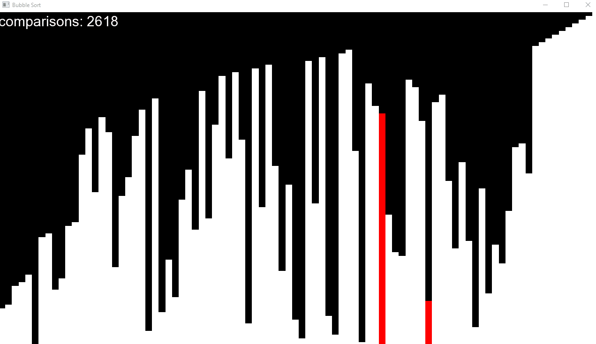

# sorting-algorithm-visualizer
A C++ application that allows users to visualize popular computer science algorithms in action numerically sorting data.

Currently supports: Bubble Sort, Bogo Sort
Future Goals: Selection Sort, Insertion Sort, Merge Sort, Quick Sort, Radix Sort, Pigeonhole Sort



# Installation

Make a clone of the git repository

```bash
git clone https://github.com/rolandyangg/sorting-algorithm-visualizer.git
```

Open the main.cpp file in your preferred IDE

Setup [SFML](https://www.sfml-dev.org/download/sfml/2.5.1/) for your preferred IDE. ([Visual Studio](https://www.sfml-dev.org/tutorials/2.5/start-vc.php) | [XCode](https://www.sfml-dev.org/tutorials/2.5/start-osx.php))

# Usage

You may modify some variables in the script to output different results. Currently working on implementing the ability to change these options when the application is run.

```C++
std::string sortName = "Sort" // Doesn't matter, this is the window name, change to whatever you want.

int sortType = 0; // Refer to the comments in the script for what each number refers to, change this to the respective algorithm you want to visualize.

window.setFramerateLimit(0); // You may change the number 0 to change the speed. (0 = unlimited framerate, 1 = 1 frame per second, 10 = 10 frames per second .etc)

const int numBlocks = 0; // The amount of elements you want to see sorted.
```

Run the file in your preferred IDE.
